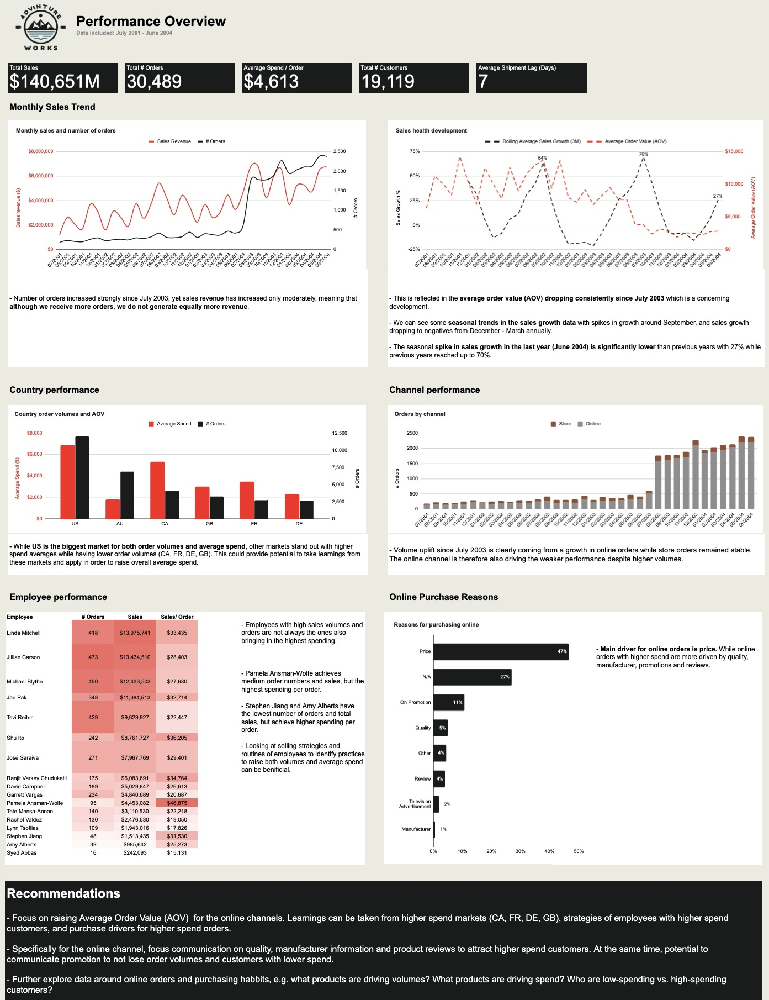

# Project: Building a Dashboard in Google Sheets

--------------------------------------------
## Project Objective

Objective for this project was to build a performance dashboard in Google Sheets based on a dataset for the fictional company AdventureWorks. The dashboard should give an overview of the below:

1. The delivery performance trend (orderdate & Shipdate lag)
2. Top salesperson by sales, by volume.
3. Top countries.
4. Top sales reasons

**Tools used:**
Google Sheets

## Project Link

[PERFORMANCE DASHBOARD](https://docs.google.com/spreadsheets/d/1r5sqY6xqsCr5pM6_MnDNLR2WuVIzia-sQVMOvdvEm6U/edit?usp=sharing)

## Project Content

The full project can be viewed in the linked Google Sheet. Below is a listing of tabs and content in the sheet.

- **DASHBOARD**: Final deliverable and dashboard
- **ASK & PREPARE**: outline of 'ASK' & 'PREPARE' phases in the data analysis process. Questions the analysis should answer and what data sources are needed to answer those.
- **PROCESS**: Steps taken during 'PROCESS' phase to clean and modify data
- **Pivot Tables**: Tab containing pivot tables which have been created and used during analysis

## Data & Context

A dataset with four data tables has been provided for the fictional company 'Adventure Works' with data on orders, emyployees, sales territories and sales reasons. 
**Data Source:** [AdventureWorks company dataset](https://learn.microsoft.com/en-us/sql/samples/adventureworks-install-configure?view=sql-server-ver16&tabs=ssms)

## Output

Google Sheets Dashboard

